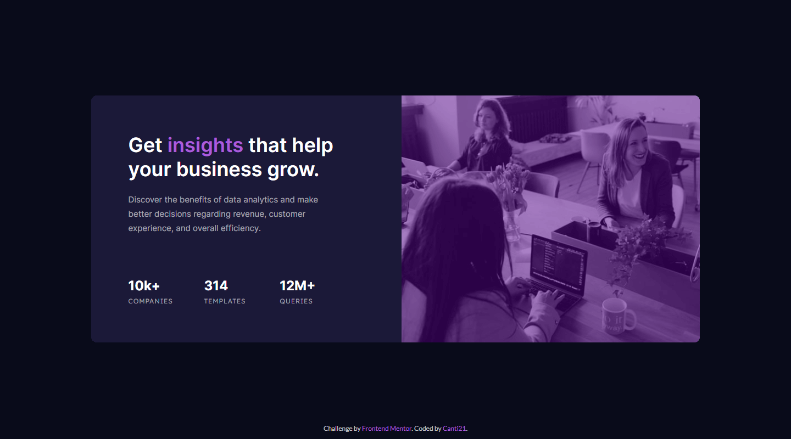
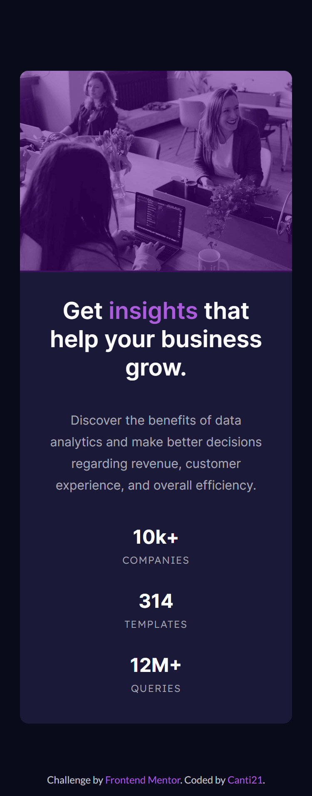

# Frontend Mentor - Stats preview card component solution

This is a solution to the [Stats preview card component challenge on Frontend Mentor](https://www.frontendmentor.io/challenges/stats-preview-card-component-8JqbgoU62).


## Table of contents

- [Overview](#overview)
  - [The challenge](#🎯-the-challenge)
  - [Screenshots](#📷-screenshots)
  - [Links](#🔗-links)
- [My process](#💭-my-process)
  - [Built with](#🛠-built-with)
  - [What I learned](#📖-what-i-learned)
- [Author](#🐱‍👤-author)
- [Acknowledgments](#✌-acknowledgments)

## Overview

### 🎯 The challenge

Users should be able to:

- View the optimal layout depending on their device's screen size

The target designs are in the [designs folder](./design/).
### 📷 Screenshots

**Here is the final product**

🖥️ Desktop View:



📱 Mobile View:



### 🔗 Links

- Solution URL: [FrontEnd Mentor]()
- Live Site URL: [Deploy]()

## 💭 My process

### 🛠 Built with

- Semantic HTML5 markup
- CSS custom properties
- Flexbox
- CSS Grid
- Mobile-first workflow

### 📖 What I learned

How to add a filter to recolor an image (without the filter css property)

```html
<div class="img-container">
  
  <span></span>
</div>
```

```css
.img-container
{
    width: 100%;
    position: relative;
}

.img-container img
{
    width: 100%;
    height: 100%;
    object-fit: cover;
}

.img-container span
{
    width: 100%;
    height: 100%;
    display: block;
    position: absolute;
    inset: 0;
    background-color: gray;
    opacity: 0.5;
}
```

## 🐱‍👤 Author

- Frontend Mentor - [@Canti21](https://www.frontendmentor.io/profile/Canti21)
- Twitter - [@Canti2100](https://www.twitter.com/Canti2100)

## ✌ Acknowledgments

Shoutout to **Vanza Setia** for some tips about the anchor tags.

[Github](https://github.com/vanzasetia)

[Frontend Mentor](https://www.frontendmentor.io/profile/vanzasetia)
